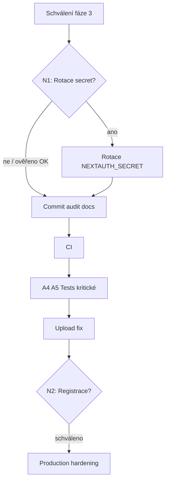

# Fáze 2 — Plán nápravy

Datum: 2026-06-04  
**STOP:** Žádné změny produkčního kódu před vaším výslovným schválením fáze 3.

Priorita řazení: (1) secrets/security → (2) baseline checky → (3) testy kritické logiky → (4) pojistky → (5) malé refaktory → (6) architektura

---

## AUTO-SAFE (fáze 3 — po schválení, malé dávky + commit po zelených checkách)

Každá dávka: jeden commit, záznam v `03-implementation-log.md`.

| ID | Dávka | Co udělat | Ověření |
|----|-------|-----------|---------|
| A1 | Audit docs commit | Commitnout pouze `docs/ai-audit/` (bez map WIP, bez `.cursor/`) | `git status` clean pro audit |
| A2 | CI workflow | Přidat `.github/workflows/ci.yml`: `npm ci` nebo `bun install`, `typecheck`, `lint`, `test`; build volitelně (Prisma EPERM na Windows runneru — cache engine) | PR checks green |
| A3 | Test: `import-records` | Unit testy `parsePlantedAt` + edge cases | `npm run test` |
| A4 | Test: `coords` | 2–3 golden WGS84→S-JTSK body | `npm run test` |
| A5 | Test: `loginUser` / `decodeSessionToken` | Mock bcrypt + decode s test secret | `npm run test` |
| A6 | Upload přípona | Whitelist mapování MIME→ext v `upload/route.ts` | manuální POST test |
| A7 | Smoke env | `test:smoke` vyžaduje `SMOKE_PASSWORD` mimo lokál | script exit ≠ 0 bez env |
| A8 | README DX | Upřesnit bun vs npm, production checklist (`ALLOW_REGISTRATION=false`) | review only |
| A9 | `.gitignore` | Ignorovat `.playwright-mcp/`, `.next-smoke*/`, případně opravit `.next-smoke /` | `git status` |
| A10 | Cursor rule (glob) | `.cursor/rules/api-routes-auth.mdc` — každá nová `/api/*` route kromě auth/register musí volat `requireAuth` | pravidlo, ne runtime |

**Nepřidávat bez návrhu (tooling brzda):** husky, sentry, nové lint pluginy, dependabot — samostatný návrh s dopadem na CI/DX.

---

## NEEDS-APPROVAL (schválit explicitně před implementací)

| ID | Položka | Proč schválení | Návrh |
|----|---------|----------------|-------|
| N1 | **SEC-001 Rotace `NEXTAUTH_SECRET`** | Invaliduje všechny session | Provést v deploy okně; uživatelé se přihlásí znovu |
| N2 | **Registrace default off v produkci** | Mění veřejné chování | `ALLOW_REGISTRATION` default `false` v kódu NEBO fail startup pokud production + true |
| N3 | **Historie git — filter-repo** | Přepis historie | Jen pokud repo private a koordinace; jinak rotace stačí |
| N4 | **Odstranit `/api` hello** | Veřejné API | Smazat nebo přesunout pod auth |
| N5 | **Middleware security headers** | Může ovlivnit map tiles / CSP | Návrh headers + test mapy |
| N6 | **Bearer → cookie-only na webu** | Breaking pro mobilní klienta | Koordinace s `docs/mobile-field-agent-send-this.md` |
| N7 | **Zapnout `noImplicitAny`** | Velký typový diff | Po menších PR |
| N8 | **Baseline commit map WIP** | 8 modified souborů mapy | Uživatel rozhodne: commit WIP / stash / revert před audit baseline |
| N9 | **ESLint pravidla zpřísnit** | Mnoho warning → errors | Po souborech |

---

## DO-NOT-FIX (raná fáze / overengineering)

| ID | Důvod |
|----|-------|
| ARCH-001 | Přestavba MapView hooků — vysoké riziko regrese mapy bez E2E |
| ARCH-002 | Sloučení NextAuth + custom login do jednoho providera — velký auth refaktor |
| ARCH-003 | Odstranění `process.env` mutace v `db.ts` — funguje pro SQLite deploy |
| D1 | Kompletní React Compiler kompatibilita pro react-hook-form — kosmetika |
| D2 | Odstranění všech unused vars najednou — šum v diffu |
| D3 | BugBot / PR reviewer — dle vašeho zadání zatím ne |
| D4 | Migrace na App Router middleware auth pro všechny stránky — duplicitní k `AuthGate` |
| D5 | Přechod z bun na npm lockfile — jen pokud tým nepoužívá bun |

---

## Doporučené pořadí po schválení fáze 3

1. **Ověřit SEC-001** lokálně (bez sdílení hodnot).
2. **A1** — audit commit.
3. **A2 + A3–A5** — pojistky + testy (priorita 3–4).
4. **A6, N2** — security chování (po schválení N2).
5. Architektura **ARCH-*** — backlog, ne automat.

---

## Co potřebuji od vás

1. **Schválení fáze 3** (celkově nebo po dávkách A1, A2, …).
2. **Baseline commit:** commitnout mapové WIP jako jeden commit, nebo je nechat uncommitted?
3. **SEC-001:** Byl v historickém `.env` reálný `NEXTAUTH_SECRET`? (ano → rotace N1).
4. **N2:** Má být registrace v produkci vždy vypnutá?
5. **Package manager:** Standardizovat na bun nebo npm v CI?

---

*Po vašem schválení pokračuji fází 3 (AUTO-SAFE dávky), `03-implementation-log.md` a případně fází 4.*
